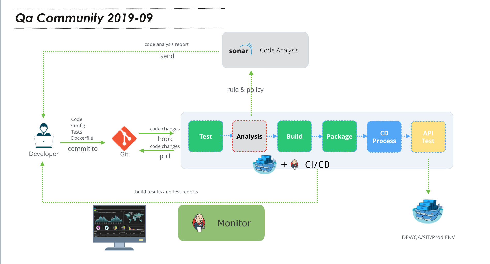

<h4 style="color: red;">Only for non-production environment</h4>

# QA-community-201909
For thoughtworks(wuhan) QA-community-201909

**Stack**: git, jenkins, docker, sonarqube




**Todo List**

- [ ] 画图，列表
- [ ] grafana
- [ ] build monitor 可视化


目的： 利用 docker 本地搭建CI/CD 环境，并执行 单元测试，集成测试，代码扫描等步骤，最后部署在本地

###  1.安装docker

- **Mac**
[install on mac](https://docs.docker.com/v17.12/docker-for-mac/install/#download-docker-for-mac)

- **Windows**
[install on windows](https://docs.docker.com/docker-for-windows/install/)

> **wait: 10m**

获取镜像到本地：
```bash
docker pull sonarqube:7.8-community
docker pull jenkins/jenkins:2.184
```

如有网络原因，可采取导入本地镜像包
```bash
docker load < my_image.tar
docker images 
```

### 2.安装 jenkins

启动Jenkins
>Start the container with mounted docker daemon
```bash
docker run -d  --name tw-jenkins \
-p 8080:8080 \
-v /var/run/docker.sock:/var/run/docker.sock \
-v $PWD/jenkins:/var/jenkins_home \
jenkins/jenkins:2.184
```
> **wait: 5s**

```bash
docker run --name tw-jcasc -d    \
-p 8081:8080   \
-v /var/run/docker.sock:/var/run/docker.sock \
cicddraft/jenkins:v0.4
```


设置Jenkins，用root用户进入容器，以便后续安装
`docker exec -it -u root tw-jenkins bash` 

在jenkins 容器中安装docker环境，为后续构建镜像和做准备，将以下命令在jenkins 容器中运行

```bash
chmod 777 /var/run/docker.sock
apt-get update && \
apt-get -y install apt-transport-https \
     ca-certificates \
     curl \
     gnupg2 \
     software-properties-common && \
curl -fsSL https://download.docker.com/linux/$(. /etc/os-release; echo "$ID")/gpg > /tmp/dkey; apt-key add /tmp/dkey && \
add-apt-repository \
   "deb [arch=amd64] https://download.docker.com/linux/$(. /etc/os-release; echo "$ID") \
   $(lsb_release -cs) \
   stable" && \
apt-get update && \
apt-get -y install docker-ce
```
> **wait: 5min**，可同时进行其他事项

配置jenkins  安装插件
- pipeline
- gitlab
- Build Monitor View

> **wait: 5min**

### 3.安装 sonarqube

>ref: https://docs.docker.com/samples/library/sonarqube/

启动sonarqube:

`docker run -d --name tw-sonarqube -p 9000:9000 sonarqube:7.8-community`

> **wait 5s**

In the window above, please click the Login button to login to the administrator account of SonarQube with “admin” username and password is also “admin”.

### 4.新建jenkins job,并运行

##### 4.1 本地运行

`git clone  https://github.com/lewisice/api-test-demo`

见 https://github.com/lewisice/api-test-demo

##### 4.2 新建一个 Freestyle 类型的job


##### 4.3 Pipeline as code ,新建 pipeline 类型job  
"jenkins" --> "New Item"  


---
what's more:
https://github.com/qinrui777/sonarqube-metric-to-grafana


      
